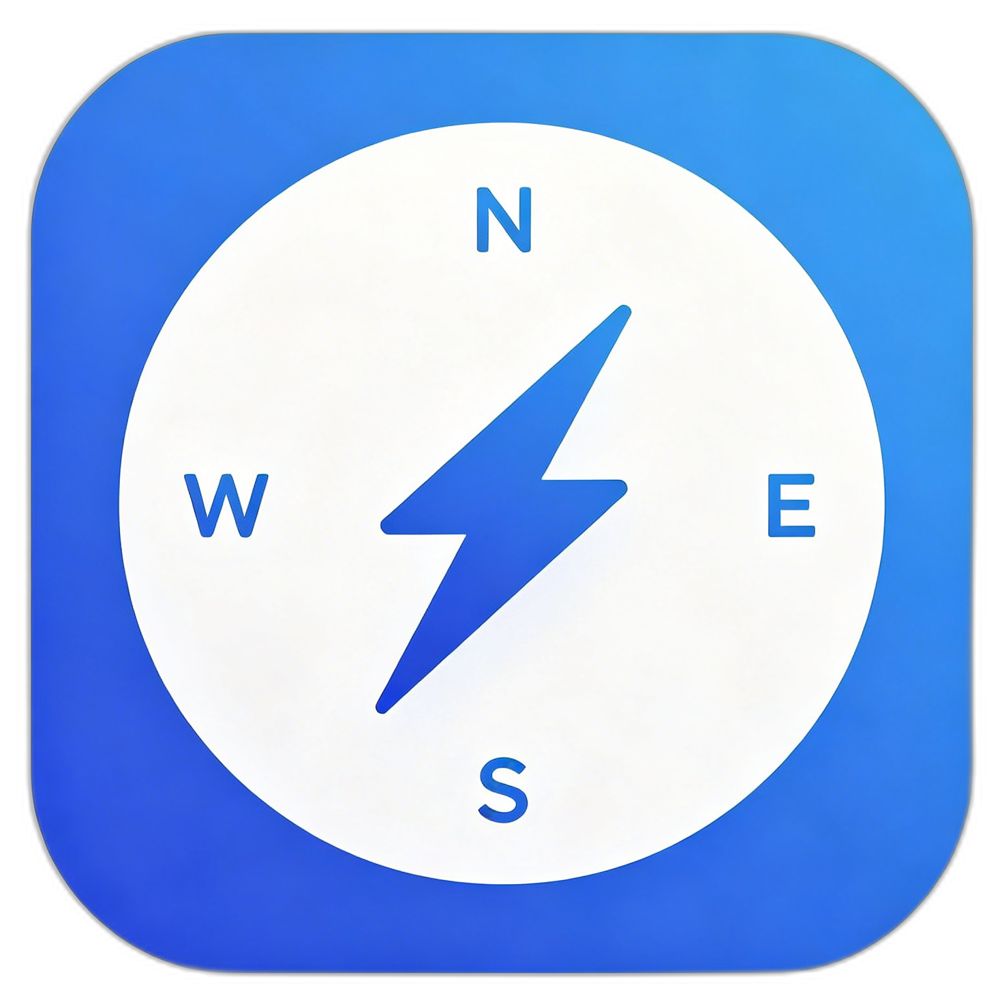

<p align="center">
  
</p>
<h1 align="center">Quick Dial · 呲啦起始页</h1>
<p align="center">
  极简无广告浏览器新标签页<br>
  <em>A minimal, ad-free browser new tab page</em>
</p>
<p align="center">
  <a href="https://cilacila.cn"></a>
  <a href="https://gitee.com/corbancc/quick-dial"></a>
  <a href="LICENSE"></a>
  
  
  <a href="https://developer.fnnas.com"></a>
</p>

---

## 这是什么？ / What is this?

> 每次打开新标签页，你应该看到干净、有用的东西，而不是广告和推广链接。
>
> *Every time you open a new tab, you should see something clean and useful — not ads and spam.*

**Quick Dial（呲啦起始页）** 替换 Chrome/Edge 的默认新标签页，内置快捷导航、多引擎搜索、天气、农历、精美壁纸。所有数据存储在本地浏览器，**无广告、无追踪、不收集任何信息**。

**Quick Dial** replaces Chrome/Edge's default new tab with quick dials, multi-engine search, weather, lunar calendar, and beautiful wallpapers. All data stays in your browser — **no ads, no tracking, no data collection**.

> 🎯 [在线体验 / Try Online](https://cilacila.cn) &nbsp;|&nbsp; 🌐 [官网 / Website](https://www.cilacila.cn)

---

## ✨ 功能 / Features

| | 中文 | English |
|---|------|---------|
| 🔍 | **多引擎搜索** — Google / 百度 / Bing / 知乎 / Bilibili / GitHub 等 12 种引擎，Ctrl+K 聚焦 | **Multi-Engine Search** — 12 engines including Google, Baidu, Bing, Zhihu, Bilibili, GitHub. Ctrl+K to focus |
| 📌 | **快捷导航** — 拖拽排序、分组管理、70+ 图标库，粘贴网址自动识别 | **Quick Dials** — Drag & drop, groups, 70+ icon library. Paste URL to auto-detect |
| 🖥️ | **飞牛NAS** — 已上架飞牛应用商店，一键安装，自动发现NAS应用 | **fnOS App** — Available on fnOS App Store, one-click install, auto-discover NAS apps |
| 🎨 | **精美壁纸** — 12 种预设渐变（深海、极光、日落、樱花……），自适应深浅文字 | **Beautiful Wallpapers** — 12 preset gradients. Auto-adapts light/dark text |
| 🌤️ | **天气与农历** — 实时天气、温度、节气、黄历日期 | **Weather & Lunar** — Live weather, temperature, solar terms, lunar dates |
| 🕐 | **多款时钟** — 6 种样式（数字/极简/经典/翻页/霓虹/二进制） | **Clock Widgets** — 6 styles (Digital, Minimal, Classic, Flip, Neon, Binary) |
| 📊 | **访问统计** — 点击计数 + 最常访问排行 | **Statistics** — Click counter + most-visited ranking |
| 📥 | **导入导出** — JSON 备份 / 书签导入（按文件夹分组） | **Import/Export** — JSON backup / bookmark import (auto-grouped) |
| 🔒 | **隐私优先** — 本地存储，不上传、不追踪、不卖广告 | **Privacy First** — Local storage only. No upload, no tracking, no ads |

### Pro 功能 / Pro Features

| 功能 Feature | 免费版 Free | Pro |
|------|:---:|:---:|
| 搜索引擎 Search Engines | 6 | 12 + 自定义 Custom |
| 导航分组 Dial Groups | 3 | 无限 Unlimited |
| 预设壁纸 Preset Wallpapers | 12 | 12 |
| 自定义壁纸 Custom Wallpaper | — | ✓ |
| 云端同步 Cloud Sync | — | ✓ |
| 自定义 CSS Custom CSS | — | ✓ |
| 价格 Price | ¥0 终身 Lifetime | ¥9.9/月 mo · ¥68/年 yr |

> 💰 [定价详情 / Pricing Details →](https://www.cilacila.cn)

---

## ⌨️ 快捷键 / Keyboard Shortcuts

| 快捷键 Shortcut | 功能 Action |
|--------|------|
| `Ctrl + K` | 聚焦搜索框 / Focus search |
| `Ctrl + ,` | 打开设置 / Open settings |
| `Ctrl + Shift + B` | 壁纸设置 / Wallpaper settings |
| `?` | 快捷键帮助 / Shortcut help |
| `Escape` | 关闭弹窗 / Close modal |

---

## 🚀 快速开始 / Quick Start

```bash
git clone https://gitee.com/corbancc/quick-dial.git
cd quick-dial
npm install
npm run dev      # 开发模式 / Dev → http://localhost:5173
npm run build    # 构建 / Build → dist/
```

## 🖥️ 飞牛NAS / fnOS

呲啦起始页已上架飞牛应用商店，支持一键安装。首次打开自动检测 NAS 上已安装的应用，生成「飞牛应用」快捷导航组。

```bash
npm run build:all   # 构建前端 + 填充 fnos/app/ui/
cd fnos && fnpack build   # 打包为 .fpk
```

在飞牛NAS应用中心 → 手动安装 → 选择 `.fpk` 文件即可。默认端口 `9527`。

> 📥 [下载最新 fpk 安装包](https://pan.butuan.cn/file.php?hash=fc24f083ec3d2e421c8c6b1db420c784)

## 🧩 安装为扩展 / Install as Extension

1. `npm run build`
2. Chrome → `chrome://extensions` → 开启开发者模式 / Enable Developer Mode
3. 加载已解压的扩展程序 → 选择 `dist/` / Load unpacked → select `dist/`
4. 打开新标签页 / Open a new tab

支持 / Supports Chrome / Edge / Brave / Arc 及所有 Chromium 内核浏览器。

---

## 🛠️ 技术栈 / Tech Stack

| 技术 Tech | 用途 Purpose |
|------|------|
| [Svelte 5](https://svelte.dev/) | 前端框架 / UI framework（runes） |
| TypeScript | 类型安全 / Type safety |
| [Vite 6](https://vitejs.dev/) | 构建工具 / Build tool |
| CSS Variables | 主题系统 / Theme system |
| LocalStorage | 本地存储 + 智能分片 / Local storage + chunking |
| [FontAwesome 6](https://fontawesome.com/) | 图标库 / Icon library |

> 📦 打包体积 ~135KB（gzip ~45KB），零外部运行时依赖 / Bundle size ~135KB (gzip ~45KB), zero runtime dependencies.

---

## 📁 项目结构 / Project Structure

```
quick-dial/
├── src/
│   ├── App.svelte                   # 根组件 / Root component
│   ├── app.css                      # 全局样式 / Global styles
│   ├── types/index.ts               # 类型定义 / Type definitions
│   ├── utils/
│   │   ├── storage.ts               # localStorage 封装 + 分片
│   │   ├── search.ts                # 搜索引擎管理
│   │   ├── theme.ts                 # 主题/壁纸/文字颜色
│   │   ├── keyboard.ts              # 快捷键
│   │   ├── weather.ts               # 天气/农历 API
│   │   ├── bookmark.ts              # 书签解析
│   │   ├── sync.ts                  # Pro 云同步
│   │   ├── payment.ts               # Pro 支付
│   │   ├── i18n.ts                  # 多语言
│   │   ├── fnos.ts                  # 飞牛应用自动发现
│   │   ├── contextMenu.ts           # 右键菜单
│   │   └── toast.svelte.ts          # Toast 通知
│   ├── stores/
│   │   ├── dials.svelte.ts          # 导航数据
│   │   ├── theme.svelte.ts          # 主题状态
│   │   ├── settings.svelte.ts       # 用户设置
│   │   ├── subscription.svelte.ts   # Pro 订阅
│   │   ├── wallpaper.svelte.ts      # 壁纸管理
│   │   └── recentSites.svelte.ts    # 最近访问
│   └── components/
│       ├── SearchBox.svelte         # 搜索框
│       ├── ClockWidget.svelte       # 时钟
│       ├── WeatherWidget.svelte     # 天气
│       ├── LunarWidget.svelte       # 农历
│       ├── SpeedDial.svelte         # 导航容器
│       ├── DialCard.svelte          # 导航卡片
│       ├── DialGroup.svelte         # 分组
│       ├── AddDialModal.svelte      # 添加/编辑
│       ├── IconPicker.svelte        # 图标选择
│       ├── GroupManage.svelte       # 分组管理
│       ├── RecentSites.svelte       # 最近访问
│       ├── WallpaperPicker.svelte   # 壁纸选择
│       ├── ImportExport.svelte      # 导入导出
│       ├── SettingsPanel.svelte     # 设置面板
│       ├── StatisticsPanel.svelte   # 访问统计
│       ├── HelpPanel.svelte         # 快捷键帮助
│       ├── OnboardingGuide.svelte   # 新用户引导
│       ├── SubscribePanel.svelte    # Pro 订阅
│       └── SyncPanel.svelte         # 云同步
├── public/
│   ├── manifest.json                # Chrome 扩展清单
│   ├── manifest-edge.json           # Edge 扩展清单
│   └── pwa-manifest.json            # PWA 清单
├── fnos/                            # 飞牛NAS应用包
│   ├── manifest                     # 飞牛应用信息
│   ├── ICON.PNG / ICON_256.PNG      # 应用图标
│   ├── app/
│   │   ├── Dockerfile               # 容器构建
│   │   ├── server.js                # Node 服务 + /api/apps
│   │   ├── docker/docker-compose.yaml
│   │   └── ui/                      # 前端静态文件
│   ├── cmd/                         # 生命周期脚本
│   ├── config/                      # 权限/资源
│   └── wizard/                      # 安装向导
├── scripts/                         # 构建脚本
│   └── build-fnos.js                # 构建+填充 fnos/app/ui/
├── website/                         # 官网（闭源）
├── api/                             # Pro 后端（闭源）
└── package.json
```

---

## ⚖️ 协议 / License

本项目采用**开放核心（Open Core）**模式 / This project follows an **Open Core** model：

| 开源 MIT / Open Source | 闭源 / Proprietary |
|------------|------|
| 前端全部组件和逻辑 / All frontend code | Pro 后端 API（同步/支付/账户）/ Pro backend (sync/payment/account) |
| 扩展清单和配置 / Extension manifests | 官网和商业化页面 / Website & commercial pages |
| 文档和部署指南 / Docs & deploy guides | 业务计划和定价 / Business & pricing |

> 👤 个人开发者独立维护，持续迭代。欢迎 Fork、Star、提 Issue！
>
> 👤 *Solo developer, actively maintained. PRs, Issues & Stars welcome!*

---

## 🔗 链接 / Links

- 🎯 在线使用 / Live: [cilacila.cn](https://cilacila.cn)
- 🌐 官方网站 / Website: [www.cilacila.cn](https://www.cilacila.cn)
- 📦 Gitee: [gitee.com/corbancc/quick-dial](https://gitee.com/corbancc/quick-dial)
- 🔒 隐私政策 / Privacy: [www.cilacila.cn/privacy.html](https://www.cilacila.cn/privacy.html)

---

<p align="center">Made with ❤️ by <a href="https://gitee.com/corbancc">corbancc</a></p>
