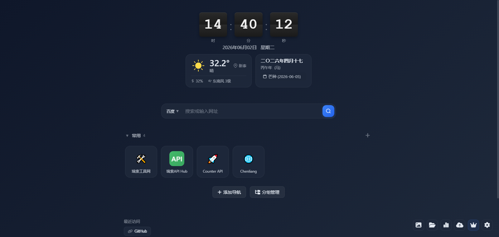
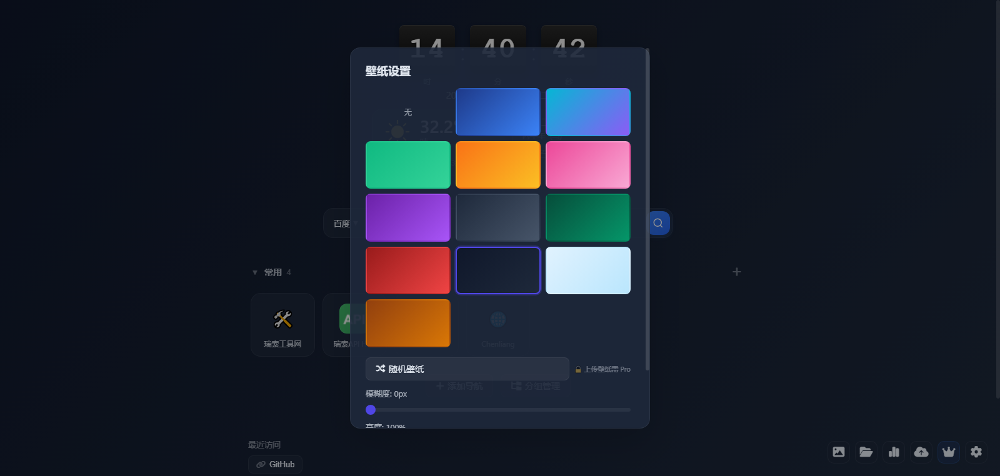
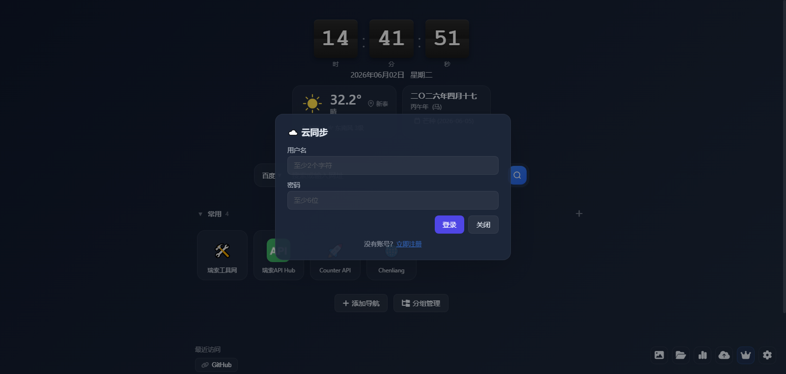
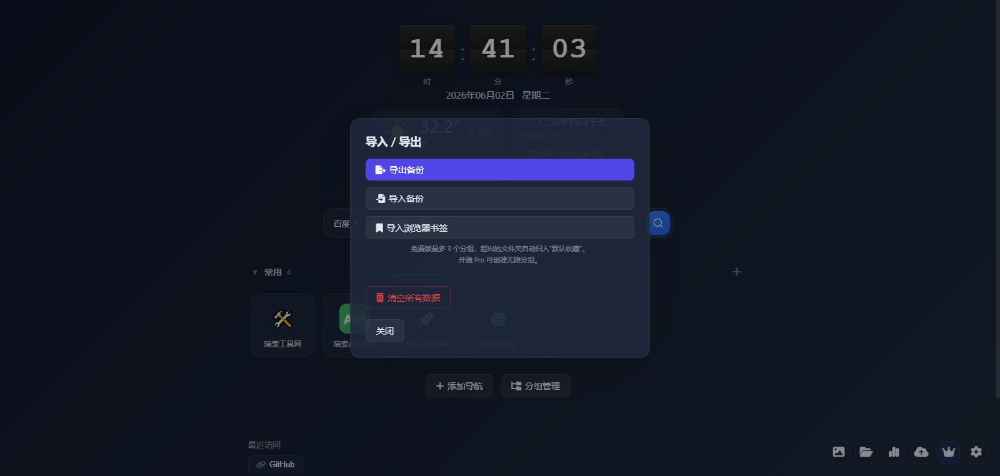
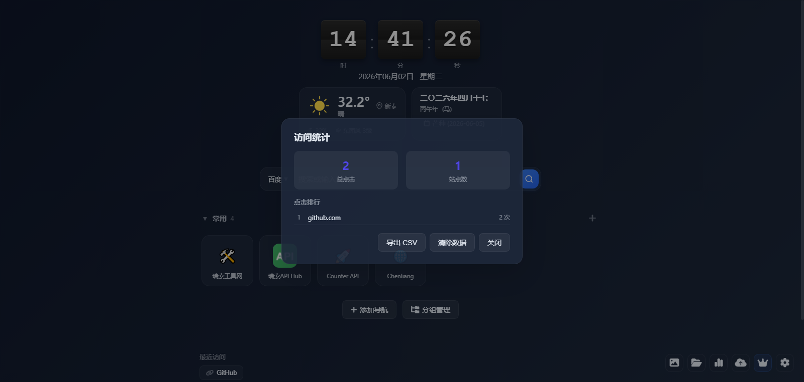
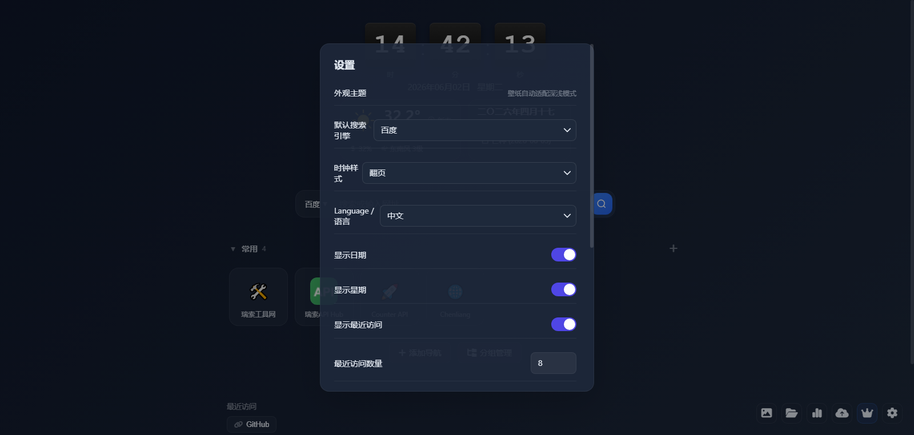

# 呲啦起始页 v1.0.4 发布 - 极简无广告浏览器新标签页

> 一款为效率而生的浏览器起始页扩展，告别冗余，回归纯粹。

## 下载地址

**蓝奏云**：https://blog.lanzout.com/b0390195ba  
**密码**：`fimm`

支持 Chrome / Edge / Firefox 三端，提供 CRX / ZIP / XPI 多种安装包。

---

## 核心亮点

### 1. 真正极简，无广告零打扰
打开新标签页，看到的只有：
- **6种时钟风格**（数字/极简/经典/翻页/霓虹/二进制）
- **实时天气** + **农历黄历**（含节气、宜忌）
- **快捷导航**卡片，一键直达常用网站
- **多引擎搜索**，百度/Google/Bing/知乎等自由切换

没有新闻瀑布流，没有推荐算法，没有悬浮广告。只有一个干净的起始页。

### 2. 21个默认导航，开箱即用
首次安装自动加载 21 个常用网站，涵盖搜索、社交、开发、娱乐等场景：
百度、哔哩哔哩、GitHub、淘宝、京东、微博、知乎、QQ邮箱、百度地图、网易云音乐、抖音、腾讯视频、豆瓣、微信公众平台、Gitee、掘金、腾讯文档、爱奇艺、CSDN、百度翻译、搜狗。

图标全部采用网站真实 Favicon，识别度更高。

### 3. 12种精美壁纸 + Pro 自定义
内置 12 款渐变壁纸（深海/极光/竹青/日落/樱花等），支持模糊度/亮度调节。

**Pro 用户**额外拥有：
- 本地上传图片作为壁纸
- 输入图片 URL 自定义背景
- 随机在线高清壁纸
- 自定义 CSS 注入，打造专属风格

### 4. 数据云端同步，换机无忧
登录账号后，一键上传/下载全部配置：
- 导航卡片与分组
- 壁纸与主题设置
- 自定义 CSS、标题、底部文案
- 最近访问记录

重装系统、换电脑、换浏览器，数据随身带走。

### 5. 导入导出 + 书签迁移
支持 JSON 备份恢复，也支持一键导入浏览器书签（Chrome/Edge 导出的 HTML 书签文件）。

免费版最多 3 个分组，Pro 版无限分组，书签再多也能井井有条。

### 6. 访问统计，洞察浏览习惯
自动记录点击次数，生成 TOP10 站点排行，支持导出 CSV 分析。

---

## 快捷键速查

| 快捷键 | 功能 |
|--------|------|
| `Ctrl + K` | 聚焦搜索框 |
| `Ctrl + ,` | 打开设置 |
| `Ctrl + Shift + B` | 壁纸设置 |
| `Ctrl + Shift + S` | 云同步 |
| `?` | 快捷键帮助 |
| `ESC` | 关闭弹窗 |

---

## 设置项一览

- **外观主题**：自动跟随系统深色/浅色模式
- **默认搜索引擎**：百度/Google/Bing/搜狗/360/知乎，Pro 额外解锁微博/B站/GitHub/DuckDuckGo/X/YouTube
- **时钟样式**：6 种风格任选
- **日期/星期/农历/天气**：独立开关，按需显示
- **最近访问数量**：3-20 条自由调节
- **语言切换**：中文/English 一键切换

---

## Pro 会员权益

| 功能 | 免费版 | Pro |
|------|--------|-----|
| 导航分组 | 3 个 | 无限 |
| 搜索引擎 | 6 种 | 12 种 + 自定义 |
| 云端同步 | ❌ | ✅ |
| 壁纸上传/URL | ❌ | ✅ |
| 自定义 CSS | ❌ | ✅ |
| 自定义标题/底部 | ❌ | ✅ |

**价格**：月度 ¥9.9 / 年度 ¥68 / 永久 ¥198

---

## 安装方法

### Chrome / Edge 离线安装
1. 打开浏览器扩展管理页 `chrome://extensions`
2. 开启右上角「开发者模式」
3. 将下载的 `.zip` 或 `.crx` 文件拖入页面
4. 完成安装

### Firefox
1. 打开 `about:addons`
2. 点击右上角齿轮 → 「从文件安装附加组件」
3. 选择 `.xpi` 文件

### 扩展商店（审核中）
Chrome 应用商店、Edge 加载项、Firefox 附加组件商店正在审核，上架后将第一时间更新。

---

## 最后

呲啦起始页是我个人开发的小工具，初衷很简单：**让浏览器新标签页回归工具本质**。

没有 KPI，没有融资，没有广告变现压力。如果你觉得好用，欢迎推荐给朋友；如果你发现 bug，欢迎反馈；如果你有新需求，也欢迎留言讨论。

GitHub：https://github.com/corbancc/quick-dial（待开源）  
官网：https://www.cilacila.cn  
使用教程：https://www.cilacila.cn/guide.html

---

*本文首发于我的博客，转载请注明出处。*
